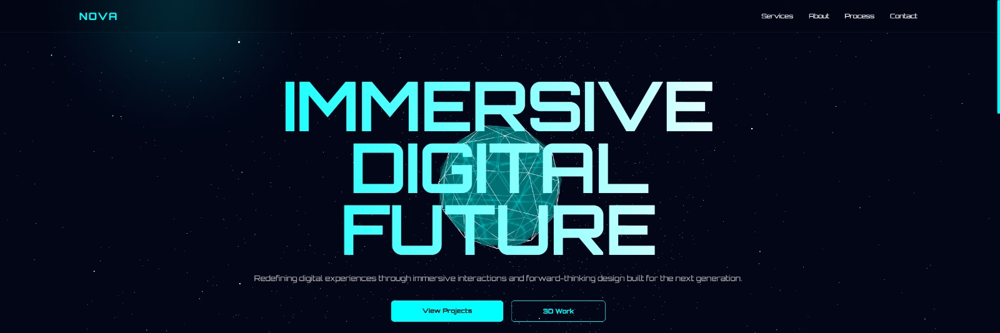
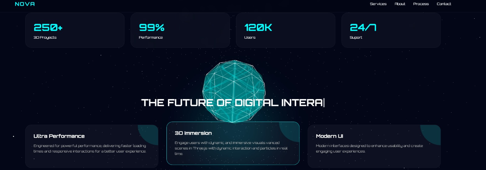

## How to Run the Project

Since this is a pure **HTML, CSS & JavaScript** project, no installation is required.

# Frontend Project - HTML, CSS & JavaScript

This project is a web interface built using **HTML, CSS, and vanilla JavaScript**, focused on strengthening frontend fundamentals, semantic structure, and DOM manipulation.

---

## Project Goal

Improve frontend development skills by building a functional, responsive, and visually clean interface while applying best practices in code structure and user experience.

---

## Technologies Used

- HTML5  
- CSS3  
- JavaScript (Vanilla JS)  
- Git & GitHub  
- ThreeJs
---

## Features

- Responsive design for different screen sizes  
- Dynamic interactions using JavaScript  
- Semantic and structured HTML layout  
- Organized and modular CSS styling  
- Basic UI/UX best practices applied  
- Interactive 3D experiences using Three.js  

---

## 📷 Preview

### Hero Section

  

### Features Section

  

### stats

  

